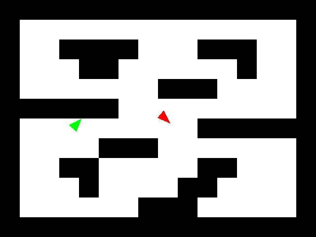
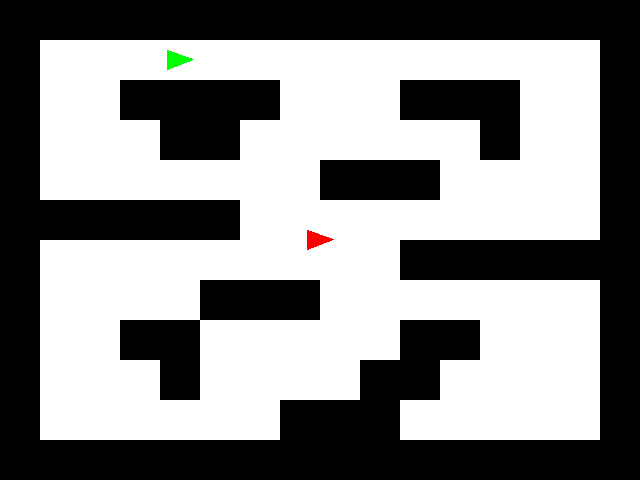

# Tree Search Controller
This project consists of three main sections, all written from scratch: A basic physics simulator with collision resolution, a tree search - based path planner, and a graphics generator for display and debugging.

## Physics
The world in this simulation consists of a 2D map with walls and obstacles. There are two triangular robot actors, with the ability to turn and move forward.

The collision detection checks whether any of the edges of two given polygons intersect. This is accomplished by comparing each pair of lines, one at a time, using this `intersects` function:
```c
    bool intersects(double x1, double y1, double x2, double y2,
                    double x3, double y3, double x4, double y4) {
        double vec1[2] = {x2 - x1, y2 - y1};
        double t11[2] = {x3 - x1, y3 - y1};
        double t12[2] = {x4 - x1, y4 - y1};
        double cv1t11 = vec1[0] * t11[1] - vec1[1] * t11[0];
        double cv1t12 = vec1[0] * t12[1] - vec1[1] * t12[0];
        bool neg1 = (cv1t11 * cv1t12 <= 0);

        double vec2[2] = {x4 - x3, y4 - y3};
        double t21[2] = {x1 - x3, y1 - y3};
        double t22[2] = {x2 - x3, y2 - y3};
        double cv2t21 = vec2[0] * t21[1] - vec2[1] * t21[0];
        double cv2t22 = vec2[0] * t22[1] - vec2[1] * t22[0];
        bool neg2 = (cv2t21 * cv2t22 <= 0);

        bool intersected = (neg1 && neg2) && !((cv1t11 * cv1t12 == 0) && (cv2t21 * cv2t22 == 0));
        return intersected;
    }
```

When a collision between one of the actors (robots) and a wall is detected, the robot is "pushed back" along the line connecting the wall and robot center until the collision is resolved.

## Graphics
To visualize the simulation, I wrote [graphics.c](treesearch_control/graphics.c) and [bmp.c](treesearch_control/bmp.c), which take the floating point coordinates of each polygon and generate a rasterized .bmp image of the simulation, like the one below.



## Tree Search
The goal of the 'chaser' robot (shown in red above) is to catch the 'runner' robot (in green). The runner moves randomly with each timestep. The chaser can either turn left, turn right, or move forward each timestep. To choose an action for the chaser, a recursive tree search is performed at each timestep. Each possible action is chosen at each node in the tree, up to a `MAX_DEPTH` of four iterations, and the action with the highest score is chosen. The score is calculated as the inverse of the distance between the robots, plus the chaser's velocity, to penalize getting stuck in walls and corners with zero velocity.
This logic is implemented in the `search_actions` function in [chase.c](treesearch_control/chase.c).

## Results
For almost every starting position of the runner robot, the chaser is able to catch it!




### Attributions
Starter code and the animation html / js files were provided through the University of Michigan's new [Programming for Robotics](https://robotics.umich.edu/academic-program/courses/rob599-f19/) course. 
